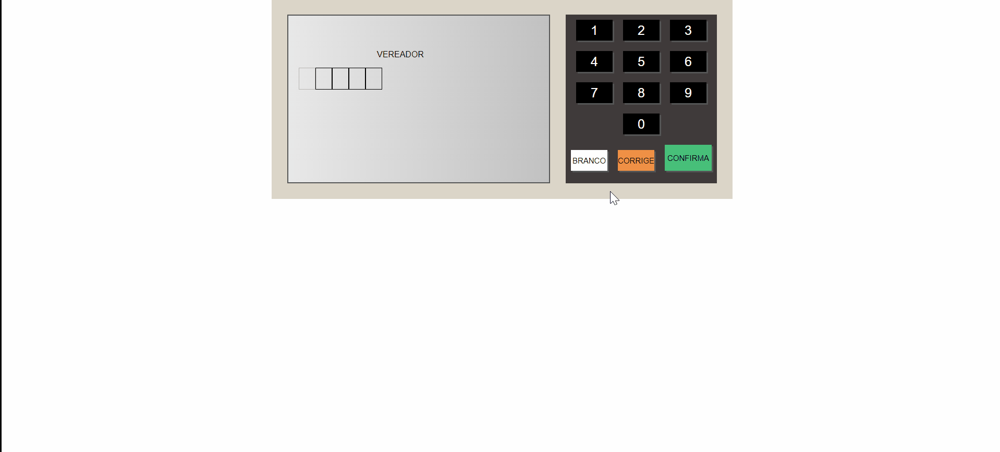

<h1 align="center">
 
  Projetos Em JavaScript
 
</h1>
 

  Este projeto é: um conjunto de projetos feito em JavaScript puro.
  Foram feitos 3 projetos:  
  urna eletrônica virtual 
  Slider com imagens passando automaticamente 
  formulário simples.

## 1º Projeto - Urna Eletrônica🐱‍🏍

  As principais funcionalidades de uma urna real foram aplicadas aqui.
   
   
  1 - <b>Ao escolher um número de um candidato existente ele aparece na tela.<b>
   
   
  2 - <b>É possível corrigir o VOTO, todos os números são removidos 
  <b>
   
  3 - <b>É possível votar BRANCO<b>
  

    
  

## 2º Projeto - Slider

  Slider simples, com imagens sendo passadas automaticamente para a direita
   
   
  1 - <b>Botão para passar a imagem para a esquerda e para a direita manualmente<b>
   
   
  2 - <b>imagens sendo passadas automaticamente a cada 2 segundos<b>

## 3º Projeto - Formulário

  Formulário simples, com registro de nome, e-mail e senha.
   
   
  1

